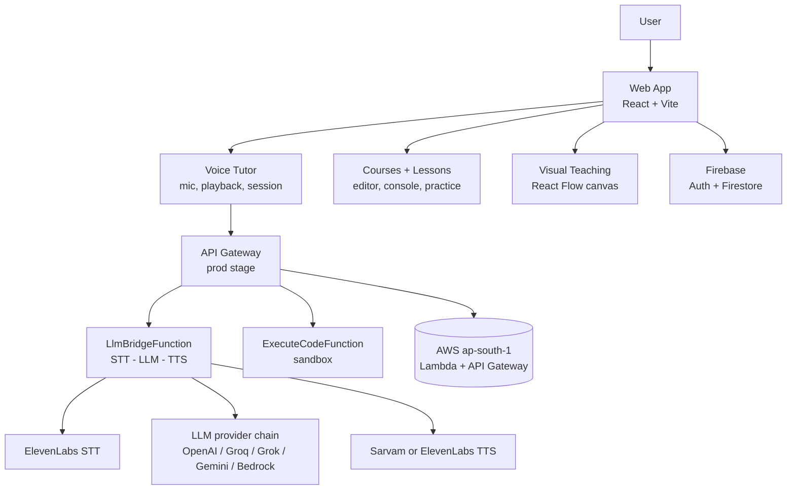

# Ecosystem

Ecosystem is an AI-powered coding education platform built around an AI voice tutor. Learners talk through concepts, watch ideas take shape as visual data-flow diagrams, and write real code — all inside one learning environment.

Talk. Code. Understand.

Ecosystem is for people learning to code — particularly cloud and data engineering — who want more than static videos and disconnected docs. It combines a conversational voice tutor, React Flow-based visual explanations, structured courses with hands-on coding, and a cinematic, scroll-driven product experience.

## Why Ecosystem?

Learning to code today often means jumping between videos, documentation, tutorials, Stack Overflow, GitHub, courses, and debugging tools. Each tab holds part of the answer, and the learner carries the context between them.

Ecosystem attempts to bring the learning loop into one environment:

Ask → Understand → Visualize → Build → Debug → Learn

You ask a question out loud, the tutor explains it, the explanation can appear as a visual diagram you can step through, and you apply it immediately in a real editor with tests — without losing your place.

## What It Does

### AI Voice Tutor

The core of Ecosystem is a voice-first tutor. The learner records audio in the browser (`MediaRecorder`), the audio is sent to a backend pipeline that transcribes it, generates a tutoring response with context about the current lesson and editor code, synthesizes speech, and plays the answer back.

Concretely, the tutor:

- Transcribes learner speech (ElevenLabs STT) and responds in natural, speakable language sized for text-to-speech.
- Speaks first: when a lesson starts, the tutor delivers a short spoken intro offering choices, then opens the microphone.
- Teaches from the actual lesson material — the request carries the lesson title, objectives, guide text, flow charts, the learner's path so far, the current task, and editor code.
- Uses function-calling tools to teach inside the product: writing demo code into the editor, reading the learner's code, highlighting line ranges while explaining them, and proposing or presenting visual diagrams.
- Adapts its toolset to the lesson mode: `theory` lessons are concept-only (no editor, no console), `light` lessons use short guided snippets, and `hands-on` lessons run the full coding loop with tests.
- Supports hands-free recording with voice-activity auto-stop, plus manual tap-to-stop and mute.

### Visual Teaching

Ecosystem uses `@xyflow/react` (React Flow) as a visual teaching canvas. Instead of explaining an architecture or data flow in text alone, the tutor can produce a validated visual plan — nodes, edges, and a step-by-step playback script — which the frontend renders as an animated diagram with a virtual hand pointer that travels between the rendered nodes.

- Node types are constrained to a teaching vocabulary: `client`, `gateway`, `compute`, `database`, `queue`, `storage`, `service`, `user`.
- Every visual payload from the model is treated as untrusted and validated (semantic kebab-case IDs, caps of 16 nodes / 24 edges / 64 steps, bounded step durations).
- Playback is step-driven (`revealNode`, `revealEdge`, `focus`, `highlightNode`, `pulse`, `annotate`, `dimOthers`, `clearFocus`, `wait`, `finish`).
- The tutor offers visuals before showing them; an explicit learner request ("show me a diagram of…") opens Visual Mode directly, including in Hindi/Hinglish phrasings the matcher recognizes.
- A compact summary of the open visual scene is sent back with the next tutor request, so follow-up questions stay grounded in the diagram.

Smaller flow charts attached to lessons (`FlowDiagram`) render separately in the lesson Guide tab as vertical timelines or horizontal step chains.

### Structured Courses

The catalog currently contains two courses, defined in `constants.ts`:

| Course ID | Title | Shape |
|---|---|---|
| `cloud-big-data-engineering` | Cloud & Big Data Engineering | Stable core course. 9 modules (Module 1–9, phases 0–8), declared as "10 Weeks (40 Lessons)", Beginner to Advanced, AWS-first and multi-cloud aware. |
| `dynamic-cloud-big-data` | Dynamic Course for Cloud & Big Data Engineering | Continuously-updated companion. 1 module, 7 tracking lessons, marked `isDynamic: true`, `lastUpdated: '2026-09'`. |

The stable course covers cloud safety, HTTP and data literacy, IAM and network boundaries, serverless APIs (API Gateway, Lambda, DynamoDB), data lakes (S3, Glue, Athena), streaming (Kinesis, Firehose), production operations, and grounding an AI tutor in your own data with Bedrock and RAG. Each lesson carries explanations, demos, oral questions, debugging challenges, exercises, an assessment, and optional flow charts; modules end with MCQ plus coding practice.

Every course is currently public — no sign-in is required to open one — and progress (completed lessons, current lesson, AI memory notes) persists to Firestore when signed in.

### Dynamic Courses

The Dynamic Course (`dynamicCourseCurriculum.ts`, id `dynamic-cloud-big-data`) teaches "what is changing now" rather than fixed foundations. Its 7 seed lessons cover tracking new cloud services, new data processing/orchestration tools, reading ecosystem shifts, data pipelines for AI workloads, choosing replacements and migrating safely, technologies worth watching, and versions/deprecations/changed best practices.

Each dynamic lesson carries `dynamic` metadata (see `DynamicLessonMeta` in `types.ts`):

- `category`: `new` | `emerging` | `updated` | `alternative` | `deprecated`
- `technology` / `version`: what the lesson tracks and which version it was written against
- `introducedAt` / `lastUpdatedAt` / `lastReviewedAt`: ISO `YYYY-MM` timestamps
- `supersedes`: IDs of lessons or topics this lesson replaces or offers an alternative to

The seed lessons currently use the `emerging`, `new`, `alternative`, and `deprecated` categories. Stable-course lessons omit `dynamic` entirely.

Important distinction: what exists today is the dynamic-course **data model** — the metadata shape plus evergreen seed content designed so individual lessons can later be added, refreshed, deprecated, or replaced by editing fields and lesson bodies. There is **no automated update engine** in the repository (no source monitoring, change detection, or AI-proposed course updates). That pipeline is explicitly future work.

### Cinematic Learning Experience

The landing page (`components/CourseSelection.tsx`) is a two-part cinematic experience:

- **Cinematic hero** (`components/cinematic-hero/`): a scroll-controlled film. Native scroll drives a normalized timeline (`timeline.ts`); a React Three Fiber canvas renders a cosmic scene with runtime-loaded GLB assets (`public/cinematic-assets/earth.glb`, `asteroids.glb`) plus a rigged laptop whose lid opens based on camera distance. The canvas mounts lazily near the viewport, renders on demand (`frameloop="demand"`), and unmounts with the route. Reduced-motion users get a static WebGL-free hero with the same copy and call to action.
- **Post-cinematic journey** (`PostCinematicJourney` + `components/journey/`): after the hero runway, a glowing orb travels a continuous SVG track. Scroll progress is the single source of truth — orb position, camera pan, track illumination, and section fades all derive from it, so reverse scrolling retraces everything exactly.

The hero is deliberately the repository's only React Three Fiber boundary; nothing outside `cinematic-hero` imports `three` or `@react-three/fiber`.

### Interactive Learning Journey

The post-cinematic journey progresses through five data-driven sections defined in `components/journey/journeySections.ts`:

1. `problem` — coding gets complicated (scattered tabs and debugging friction)
2. `voice` — your voice becomes the interface
3. `understand` — guided understanding, not just answers
4. `build` — from stuck to building (debug while you build)
5. `confidence` — one place to grow, ending with an "Explore courses" call to action

Sections own windows of a shared 0–1 journey progress value and crossfade around boundaries; text panels alternate sides so the orb track stays the visual spine. Each section reserves a video slot, but no video assets ship with the repository yet — every slot currently renders as a labeled placeholder, and adding a `src` path swaps it to a real `<video>` with no other code changes.

## Architecture



- **Frontend**: React 18 + TypeScript + Vite, Tailwind CSS, Monaco editor, React Flow, Framer Motion, Three.js via React Three Fiber (hero only), Firebase client.
- **AI / Tutor**: browser voice handling (`hooks/useVoiceTutor.ts`, `services/voiceService.ts`) plus the server pipeline in `infra/src/llm-bridge/` (request parsing, provider abstraction, system prompt and tools, visual-plan handling, TTS routing, in-memory sessions).
- **Backend**: two AWS Lambda functions behind one API Gateway (`BackendApi`, stage `prod`): the voice pipeline (`POST /voice`, `POST /intro`, `GET /session`) and the code-execution sandbox (`POST /execute`).
- **Infrastructure**: AWS SAM (`infra/template.yaml`, `infra/samconfig.toml`, stack `sam-app`, region `ap-south-1`) deployed via GitHub Actions with OIDC.
- **Data / Course layer**: `cloudBigDataCurriculum.ts` (stable course assembled from `curriculum/cloud/` phases), `dynamicCourseCurriculum.ts` (dynamic course), `constants.ts` (catalog), Firestore for user profiles, progress, and notes.

## Tech Stack

| Layer | Technology | Purpose |
|---|---|---|
| Frontend | React 18, TypeScript | UI |
| Build | Vite 5 | Dev server and production build |
| Styling | Tailwind CSS 3, PostCSS, Autoprefixer | Utility styling |
| Editor | @monaco-editor/react | In-lesson code editor |
| Visual teaching | @xyflow/react 12 | Data-flow teaching canvas |
| 3D / cinematic | three, @react-three/fiber 8, ogl | Cosmic hero scene (hero only) |
| Motion | framer-motion 13 | Journey, orb, and UI animation |
| Icons | lucide-react | UI iconography |
| Auth & DB | Firebase 10 (Auth + Firestore) | Sign-in, progress, notes |
| Compute / API | AWS Lambda (nodejs20.x, arm64), API Gateway | Voice pipeline + code sandbox |
| IaC | AWS SAM | Template, build, deploy |
| STT | ElevenLabs (`scribe_v2`) | Speech-to-text |
| LLM | OpenAI (`gpt-4o-mini`), Groq (`openai/gpt-oss-20b`), xAI Grok (`grok-4-fast`), Gemini (`gemini-2.5-flash`), Bedrock (Claude 3 Haiku) | Tutor brain via provider chain |
| TTS | Sarvam (`bulbul:v3`, default), ElevenLabs (`eleven_turbo_v2_5`, optional) | Spoken tutor voice |
| CI/CD | GitHub Actions + AWS OIDC | Test, build, and deploy Lambda backend |
| Tests | node:test (built-in) | Backend unit tests and visual-tutor logic tests |

Only the technologies above are used. There is no FossFLOW dependency and no ElevenLabs Conversational AI agent — the voice pipeline is custom.

## Project Structure

```
.
├── App.tsx                        # View router: landing | courses | lesson | explanations
├── index.tsx / index.html         # Entry point and HTML shell
├── constants.ts                   # Course catalog (stable + dynamic), defaults
├── types.ts                       # Lesson, course, dynamic-metadata, visual types
├── cloudBigDataCurriculum.ts      # Stable course assembly (phases 0-8)
├── dynamicCourseCurriculum.ts     # Dynamic course (1 module, 7 lessons)
├── curriculum/cloud/              # Stable course content: phases, flows, modes, practice
├── components/
│   ├── CourseSelection.tsx        # Landing: cinematic hero + journey
│   ├── LearningView.tsx           # Lesson experience (editor, tutor, visuals)
│   ├── cinematic-hero/            # Scroll-driven 3D film (R3F boundary)
│   ├── journey/                   # Post-cinematic journey data + rendering
│   ├── scroll-story/              # Shared story content for the journey
│   ├── visual-tutor/              # React Flow canvas, schema, playback engine
│   ├── tutor-orb/                 # Tutor voice orb UI
│   └── ...                        # Conversation, workspace, practice, nav panels
├── pages/                         # Courses, Dashboard, Explanations, Login, Signup
├── hooks/                         # useVoiceTutor, useCourseProgress, notes, activity
├── services/                      # voiceService, dbService, authService
├── lib/                           # Firebase init, shared utils
├── utils/                         # Audio levels, safe code executor
├── contexts/                      # Auth and theme providers
├── styles/                        # Global CSS
├── infra/
│   ├── template.yaml              # SAM: API Gateway + 2 Lambdas
│   ├── samconfig.toml             # Stack name, region (no secrets)
│   ├── src/llm-bridge/            # Voice pipeline: providers, tutor, tools, TTS
│   ├── src/execute-code/          # POST /execute sandbox
│   └── test/                      # Backend node:test suites
├── test/                          # Frontend logic tests (visual tutor, journey math)
├── public/cinematic-assets/       # earth.glb, asteroids.glb, textures, ATTRIBUTION.md
├── docs/research/                 # Research notes
└── .github/workflows/             # deploy-lambda.yml (OIDC deploy on infra changes)
```

Only directories that exist in the repository are listed. `dist/`, `node_modules/`, and `.aws-sam/` are build artifacts.

## Getting Started

### Prerequisites

- Node.js 20 or later (CI pins Node 20; Lambda runs `nodejs20.x`).
- npm (the repository uses `package-lock.json`; install with `npm install` / `npm ci`).
- For the backend: AWS CLI with credentials able to manage Lambda / API Gateway / IAM / CloudFormation, and the AWS SAM CLI. Region is `ap-south-1`.
- For the deployed tutor brain: Bedrock model access for `anthropic.claude-3-haiku-20240307-v1:0` in `ap-south-1` (only when using the Bedrock provider), plus API keys for whichever LLM/STT/TTS providers you enable.

### Installation

```bash
git clone <repo-url>
cd ecosystem-voicecode
npm install
cp .env.example .env   # Windows: copy .env.example .env
```

Fill in `.env` as described below. `.env` is gitignored — never commit it.

### Environment Variables

Frontend (browser-safe, `VITE_` prefix only):

| Variable | Required | Purpose / where used |
|---|---|---|
| `VITE_API_BASE_URL` | Yes, for voice/code features | API Gateway base URL (the `ApiBaseUrl` SAM stack output). Consumed in `services/voiceService.ts`. Without it the tutor and `/execute` calls throw a "backend not configured" error. |
| `VITE_FIREBASE_*` | No | Firebase web config overrides (`API_KEY`, `AUTH_DOMAIN`, `PROJECT_ID`, etc.). `lib/firebase.ts` falls back to a baked-in config when unset. |

Backend / infrastructure (server-side only — never prefix with `VITE_`):

| Variable | Default | Purpose |
|---|---|---|
| `LLM_PROVIDER` | `openai` | Primary tutor LLM: `openai` \| `groq` \| `grok` \| `gemini` \| `bedrock` |
| `LLM_FALLBACK_PROVIDER` | `groq,gemini` | Comma-separated fallback chain, or `none` to disable |
| `OPENAI_API_KEY` / `OPENAI_MODEL_ID` | `gpt-4o-mini` | OpenAI provider |
| `GROQ_API_KEY` / `GROQ_MODEL_ID` / `GROQ_REASONING_EFFORT` | `openai/gpt-oss-20b` / `low` | Groq provider |
| `GROK_API_KEY` / `GROK_MODEL_ID` | `grok-4-fast` | xAI Grok provider |
| `GEMINI_API_KEY` / `GEMINI_MODEL_ID` | `gemini-2.5-flash` | Gemini provider |
| `BEDROCK_MODEL_ID` / `BEDROCK_REGION` | `anthropic.claude-3-haiku-20240307-v1:0` / `ap-south-1` | Bedrock provider (IAM role, no keys) |
| `ELEVENLABS_API_KEY` / `ELEVENLABS_VOICE_ID` | — / `y0IUmXZMBt1M9uXCVcPL` | ElevenLabs STT and optional TTS |
| `STT_MODEL_ID` | `scribe_v2` | ElevenLabs speech-to-text model |
| `TTS_PROVIDER` | `sarvam` | Spoken-voice provider: `sarvam` \| `elevenlabs` |
| `SARVAM_API_KEY`, `SARVAM_TTS_MODEL`, `SARVAM_TTS_SPEAKER`, `SARVAM_TTS_LANGUAGE_CODE`, `SARVAM_TTS_OUTPUT_AUDIO_CODEC`, `SARVAM_TTS_SAMPLE_RATE`, `SARVAM_TTS_PACE`, `SARVAM_TTS_TEMPERATURE` | `bulbul:v3`, `shubh`, `en-IN`, `mp3`, `24000`, `0.88`, `0.6` | Sarvam TTS voice |
| `TTS_MODEL_ID`, `TTS_OUTPUT_FORMAT`, `TTS_SPEED`, `TTS_STABILITY`, `TTS_STYLE` | `eleven_turbo_v2_5`, `mp3_44100_64`, `0.88`, `0.3`, `0.45` | ElevenLabs TTS delivery tuning |

Use placeholder values such as `OPENAI_API_KEY=your_api_key_here`. The full template with comments lives in `.env.example`; the authoritative parameter list lives in `infra/template.yaml`.

### Running Locally

```bash
npm run dev      # Vite dev server (http://localhost:5173)
```

This starts the frontend only. Voice tutoring and server-side code execution additionally require a reachable backend (`VITE_API_BASE_URL`), either a deployed stack or a local SAM API.

```bash
npm run preview  # Preview the production build locally
```

### Testing

```bash
npm test        # node:test — backend suites plus visual-tutor/journey logic tests
npm run build   # tsc type-check + Vite production build
```

- `npm test` runs `node --test`, which discovers `infra/test/*.test.mjs` (STT, Bedrock/Gemini/Groq/Grok/OpenAI providers, TTS, multipart parsing, full voice pipeline, error handling) and `test/*.test.mjs` (visual-tutor logic, journey progress math).
- External APIs are mocked in tests — no real provider calls are made and no secrets are needed.
- `npm run build` is the type-check gate (`tsc && vite build`).

### Production Build

```bash
npm run build
```

This runs the TypeScript compiler followed by the Vite build and emits the static site into `dist/`. Hosting config examples for Amplify (`amplify.yml`) and Vercel (`vercel.json`) exist at the repo root; set `VITE_API_BASE_URL` in the hosting provider's environment so the built frontend can reach the backend.

## AWS / Deployment

The backend is the SAM application in `infra/`:

- `BackendApi` — API Gateway, stage `prod`, with `multipart/form-data` binary support and open CORS defaults (narrow via `AllowedOrigin` in production).
- `LlmBridgeFunction` — `POST /voice`, `POST /intro`, `GET /session`. Memory 1024 MB, 29 s timeout, `nodejs20.x` on `arm64`. Holds all provider keys as environment variables; Bedrock access comes from the Lambda IAM role scoped to `bedrock:InvokeModel` on the configured model ARN.
- `ExecuteCodeFunction` — `POST /execute`. Runs learner JavaScript in a server-side sandbox (`EXEC_TIMEOUT_MS=2000`), 10 s timeout, 256 MB.
- Stack name `sam-app`, region `ap-south-1` (see `infra/samconfig.toml`).

API surface:

| Method | Path | Description |
|---|---|---|
| `POST` | `/voice` | Audio (multipart `audio` file, or JSON base64) plus lesson/editor context in → `{ sessionId, transcript, response, audio, audioMimeType, audioEncoding, toolCalls }` |
| `POST` | `/intro` | Text-only lesson intro (no microphone needed) → `{ sessionId, response, audio, audioMimeType, toolCalls }` |
| `GET` | `/session` | Issues a `{ sessionId }` for conversation context |
| `POST` | `/execute` | Runs learner JavaScript server-side → `{ output, results }` |

TTS audio is returned as base64 inside JSON — acceptable because tutor utterances are short (1–3 sentences); long audio should switch to binary/streaming to avoid the ~33% base64 overhead.

### Local SAM Development

```bash
sam build --template infra/template.yaml
sam local start-api --template infra/template.yaml
```

Standard SAM local development against the repository template. Pass parameters on the command line (never commit them — `samconfig.toml` deliberately stores no secrets).

### Production Deployment

Manual deploy:

```bash
sam build --template infra/template.yaml
sam deploy --guided --template infra/template.yaml \
  --parameter-overrides \
    ElevenLabsApiKey=your_key_here \
    ElevenLabsVoiceId=your_voice_id_here
```

Then copy the `ApiBaseUrl` stack output into the frontend environment as `VITE_API_BASE_URL` and rebuild.

Continuous deployment (`.github/workflows/deploy-lambda.yml`): every push to `main` touching `infra/**` (or the workflow itself) runs checkout → Node 20 → `npm ci` (root and `infra/src/llm-bridge`) → `npm test` (mocked, no secrets) → OIDC login to AWS (`AWS_DEPLOY_ROLE_ARN` secret) → `sam build` → `sam deploy` to stack `sam-app` in `ap-south-1`. The workflow never builds or deploys the frontend. Manual runs via `workflow_dispatch` ignore the path filter. A failed `sam deploy` rolls the CloudFormation stack back automatically; reverting a bad-but-successful deploy means redeploying the last good code.

## AI / Tutor Architecture

```
mic (MediaRecorder) → POST /voice → ElevenLabs STT → provider chain (LLM + tools)
→ text reply → Sarvam/ElevenLabs TTS → base64 audio JSON → speaker + transcript UI
```

1. **Capture**: `hooks/useVoiceTutor.ts` records audio with hands-free silence auto-stop (or manual stop), keeping the last 8 conversation turns as client history.
2. **Request**: `services/voiceService.ts` posts multipart audio plus lesson context (`lessonTitle`, `objectives`, `lessonGuide`, `lessonFlows`, `learningPath`, `lessonTask`, `editorCode`, `lessonMode`, `visualScene`, `aiMemory`, `history`, `sessionId`).
3. **Transcribe**: `infra/src/llm-bridge/elevenlabs.mjs` runs STT (`scribe_v2`). Empty transcripts get an instant "I didn't catch that" reply with no LLM call.
4. **Reason**: `tutor.mjs` builds a provider from `LLM_PROVIDER` / `LLM_FALLBACK_PROVIDER` (`providers/` has one module per vendor: OpenAI, Groq, Grok, Gemini, Bedrock). The chain walks providers in order; if all fail, the combined error is surfaced instead of blaming one vendor. The system prompt and tool declarations live in `tools.mjs`; the tool loop runs at most 2 iterations per turn.
5. **Act**: tool calls (`writeCode`, `readCode`, `highlightLines`, `executeCode`, `highlightCode`, `controlApp`, visual-explanation tools) execute against the editor/app via the callback passed into `useVoiceTutor`; theory lessons receive a restricted toolset.
6. **Speak**: `tts.mjs` routes to Sarvam (default) or ElevenLabs; the phone-ready text plus base64 MP3 return to the browser, which decodes and plays it.
7. **Remember**: server sessions live in an in-memory map on the warm Lambda container (16 turns max, 30-minute TTL, opportunistic eviction) — durable multi-container sessions would need an external store.

The intro turn (`POST /intro`) skips STT: it runs the same tutor + TTS path from a templated lesson-opening offer so the tutor can speak first instantly.

## Visual Teaching System

React Flow is used because data-flow teaching needs a real canvas: pannable, zoomable nodes and edges the learner can inspect while the tutor narrates, rather than a static image.

- **Plans are data**: the model emits `{ title, nodes, edges, steps }`, validated by `visualSchema.ts` (frontend) and mirrored checks in `infra/src/llm-bridge/visual.mjs` (backend). IDs are semantic kebab-case (`/^[a-z][a-z0-9-]{0,47}$/`), e.g. `api-gateway`, so the tutor, the scene summary, and the UI all refer to the same concepts.
- **Playback is an engine**: `VisualPlaybackEngine` + `visualReducer` reveal nodes/edges step by step; `VisualTutorPointer` moves a virtual hand between the actual rendered DOM rectangles. Reduced-motion users get the same content without the travel animation.
- **Interaction is a loop**: the tutor proposes a visual (`VisualOfferCard`), the learner accepts, the canvas plays, and `visualSceneSummary` feeds the scene state back into the next tutor turn for grounded follow-ups. Follow-up steps can extend a plan without rebuilding it.
- **Fallbacks exist**: if a provider skips a required visual tool call on an explicit learner request, the backend builds a deterministic diagram from the learner's path so nobody stares at an empty canvas.

## Dynamic Course System

The dynamic course (`dynamic-cloud-big-data`, `isDynamic: true`, `lastUpdated: '2026-09'`) is one module with 7 lessons, each carrying the `DynamicLessonMeta` model documented under "Dynamic Courses" above. The supported change categories are `new`, `emerging`, `updated`, `alternative`, and `deprecated`.

Supporting fields exist so the course can evolve lesson-by-lesson: `technology`/`version` pin what a lesson was written against, the `*At` timestamps record when it appeared and was last updated or reviewed, and `supersedes` records what it replaces — so cards, dashboards, and future tooling can distinguish evolving content from the stable core without ID sniffing.

Current state versus future: the **metadata/content model is implemented**; an **automated course-update engine is not**. A future pipeline (sources → change detection → AI proposal → review → course update) would operate by editing exactly these fields and lesson bodies.

## Design & Product Experience

The design philosophy is cinematic, conversational, visual, and progressive: a scroll-driven cosmic hero earns attention, the orb journey narrates the value proposition, and the lesson view keeps voice, visuals, and code in one focused surface. The app supports light/dark themes (`ThemeContext`), Firebase-backed progress dashboards, per-lesson notes, and module practice views. Layouts are responsive with a dedicated mobile journey track variant.

## Accessibility & UX

What the code actually implements:

- `prefers-reduced-motion` is respected in the cinematic hero (static WebGL-free fallback), the journey/orb rendering, and the visual-tutor pointer.
- The 3D canvas has an error boundary with a readable text fallback if WebGL fails on a device.
- Journey videos carry `aria-label`s; the microphone and playback controls expose explicit states (recording, processing, playing, muted, error).
- Content layers keep text readable over the cosmic scene, and the lesson route renders without the marketing nav/footer to keep focus on learning.

## Performance

- The visual-tutor canvas (`@xyflow/react`) and the debug laptop lab are `React.lazy`-loaded, keeping them out of the main bundle.
- The hero canvas renders on demand (`frameloop="demand"`, capped pixel ratio), mounts only near the viewport via `IntersectionObserver`, and unmounts on route change; `three`/`@react-three/fiber` are fenced inside `cinematic-hero`.
- GLB assets ship as resized, repackaged copies loaded at runtime rather than bundled.
- Voice payloads clip lesson context (guide text, flows, editor code) to fixed budgets so prompts cannot bloat unboundedly.

No benchmarks are claimed; the above are structural decisions visible in the code.

## Development Guidelines

- Keep changes scoped; preserve the existing layering (frontend → voice service → Lambda providers; courses as data; hero as the only 3D boundary).
- Run `npm test` and `npm run build` before opening a PR — type-check, unit tests, and production build must all pass.
- Do not commit `.env`, secrets, or SAM build output (`.aws-sam/`, `dist/`).
- Do not add large binary assets without justification — the GLB files are already size-optimized; keep it that way.
- Keep provider keys server-side: anything the browser needs must use the `VITE_` prefix, and provider secrets must never gain it.

## Contributing

1. Fork the repository and create a branch for your change.
2. Make the change, keeping it scoped to one concern.
3. Validate locally: `npm test` and `npm run build`.
4. Open a pull request describing what changed and how you verified it.

Backend changes under `infra/**` on `main` trigger the Lambda deploy workflow, so call out any infrastructure impact in the PR.

## Roadmap

Planned or future work — explicitly labeled as not yet implemented:

- **Automated dynamic-course updates**: the metadata model anticipates a sources → change detection → AI proposal → review → course-update pipeline; none of it exists yet.
- **Real journey videos**: all five journey video slots are placeholders awaiting actual video files.
- **Durable tutor sessions**: server conversation state is in-memory per warm container; a DynamoDB/ElastiCache-backed session store is the noted next step.
- **Expanded tutoring and visual coverage**: more visual teaching experiences and additional course domains beyond cloud and big data.

## License

License information has not yet been specified — no `LICENSE` file or license field exists in the repository.

## Acknowledgements

- Earth 3D model by [Akshat](https://sketchfab.com/shooter24994) via [Sketchfab](https://sketchfab.com/3d-models/earth-41fc80d85dfd480281f21b74b2de2faa), CC BY 4.0.
- Asteroids Pack (rocky version) by [SebastianSosnowski](https://sketchfab.com/SebastianSosnowski) via [Sketchfab](https://sketchfab.com/3d-models/asteroids-pack-rocky-version-adde1ecf129e4509be8af61b84bafa85), CC BY 4.0.
- Resized, web-repackaged copies live in `public/cinematic-assets/`; see `public/cinematic-assets/ATTRIBUTION.md`.
- Third-party agent skills vendored under `.agents/skills/` are attributed in `THIRD_PARTY_NOTICES.md`.

## Status

Ecosystem is under active development. The core learning experience, AI voice tutor pipeline, React Flow visual teaching system, two-course catalog, dynamic-course metadata model, and cinematic landing plus learning journey are implemented, while tutoring depth, visual coverage, and content automation continue to evolve.
