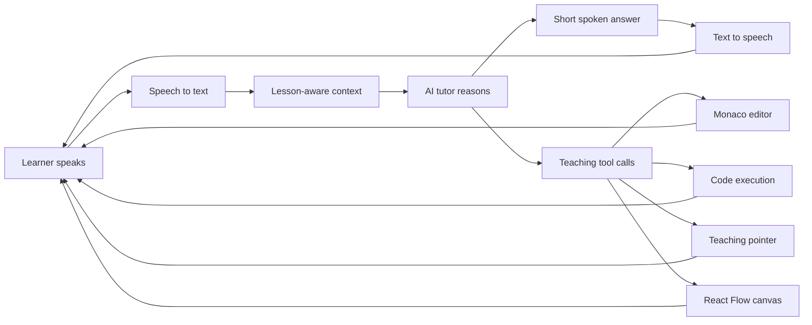
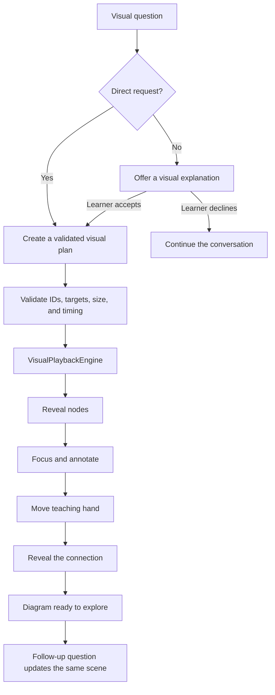
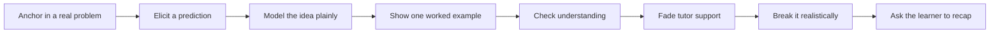
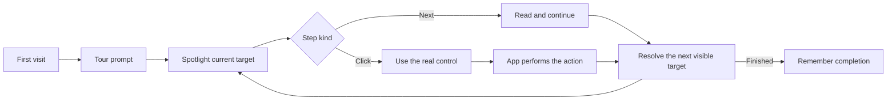
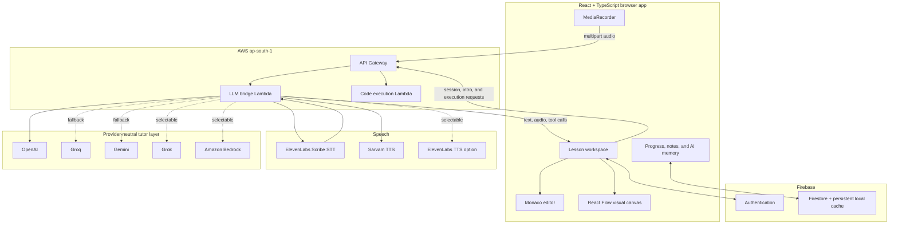

# Ecosystem

### The AI classroom that listens, speaks, writes, runs, points, draws, and remembers.

Ecosystem is a voice-first learning environment for cloud and big data engineering. A learner can talk naturally to an AI tutor, watch it write and explain code inside Monaco, run the code, follow an animated teaching pointer, and ask for a live architecture or flowchart without leaving the lesson.

The result feels less like reading a course and more like sitting beside a patient technical mentor. The tutor knows the current course, module, lesson, objectives, guide, editor contents, recent conversation, and saved learning memory. Its spoken answer and its actions on screen are part of the same turn.

> **The big idea:** one conversation controls an entire learning workspace—voice, curriculum, code, execution, visual diagrams, practice, progress, and notes.

---

## What makes Ecosystem feel alive

A normal interaction can unfold like this:

1. The learner opens a chapter and Ecosystem introduces what they are about to learn.
2. The learner asks a question by voice.
3. ElevenLabs transcribes the audio.
4. The tutor receives the transcript together with the exact lesson context and current editor code.
5. The selected LLM answers and may call safe, purpose-built teaching tools.
6. The interface writes code, highlights a precise range, moves the virtual teaching hand, runs the program, advances the lesson, or builds a diagram.
7. Sarvam or ElevenLabs turns the response into speech.
8. The learner hears the explanation while the matching action happens on screen.



This loop is the heart of Ecosystem: the AI does not merely describe what a learner should look at. It can bring the relevant thing into view and teach through it.

---

## The current experience

| System | What it does today |
| --- | --- |
| **Voice tutor** | Records browser audio, transcribes it with ElevenLabs Scribe, sends it through a configurable LLM chain, and speaks the answer with Sarvam or ElevenLabs. |
| **AI code partner** | Reads and writes the Monaco editor, highlights exact lines or expressions, runs JavaScript, resets work, and responds to lesson navigation requests. |
| **Live visual tutor** | Converts a safe declarative plan into a paced React Flow explanation with nodes, edges, focus, annotations, pulses, and a virtual hand. |
| **Structured curriculum** | Delivers a 10-week Cloud & Big Data Engineering path with 40 lessons across 9 modules, from safety and HTTP to streaming, operations, and retrieval-augmented generation. |
| **Dynamic course** | Adds an ongoing 7-module track for evaluating new services, ecosystem shifts, AI infrastructure, migrations, deprecations, and emerging practices. |
| **Adaptive lesson modes** | Uses `theory`, `light`, and `hands-on` modes so the workspace matches the chapter instead of forcing an editor into every lesson. |
| **Practice system** | Includes end-of-module multiple-choice checks, coding drills, progressive hints, animated explanations, tests, and reference solutions. |
| **Learning memory** | Stores course progress, completed lessons, lesson notes, AI memory, and learning activity in Firestore for authenticated learners. |
| **Interactive guided tour** | Leads first-time learners through 21 site-wide steps, including real clicks, navigation, code execution, exercises, notes, voice tutoring, and visual teaching. |
| **Cinematic product journey** | Introduces the platform with a scroll-driven 3D Earth, space environment, asteroids, and a rigged laptop sequence, with reduced-motion handling. |
| **Provider resilience** | Supports OpenAI, Groq, Gemini, Grok, and Amazon Bedrock behind one tutor interface, including an ordered fallback chain. |

### Verified curriculum scale

- **40 stable-course lessons:** 13 theory, 14 light, and 13 hands-on.
- **18 lesson-specific guide flow sets** for concepts where sequence matters.
- **9 module practice packs** containing 36 multiple-choice questions and 31 coding drills.
- **7 dynamic-course lessons**, each carrying change metadata such as category, technology, review date, and superseded topics.
- **Two public course experiences:** the stable Cloud & Big Data Engineering course and its continuously evolving companion.

---

## The live React Flow teaching engine

The visual tutor is one of Ecosystem's most ambitious pieces. A learner can say **“make a flowchart,” “show me visually,”** or **“draw the architecture.”** The tutor returns semantic teaching data rather than executable UI code.



The plan can contain up to 16 typed nodes, 24 edges, and 64 bounded playback steps. Supported actions include revealing nodes and edges, focusing, highlighting, pulsing, annotating, dimming unrelated elements, waiting, clearing focus, and finishing. Invalid plans are removed before reaching the browser, and a deterministic lesson-derived fallback can still produce a useful journey when a provider omits the required visual call.

The canvas deliberately preserves the code workspace underneath it. Switching back to code restores the learner's editor contents, console output, and tabs. Follow-up questions manipulate the existing semantic scene instead of rebuilding a disconnected diagram.

---

## Human teaching behaviour, encoded

Ecosystem has a teaching system rather than a generic assistant persona. The runtime prompt follows a concrete loop:



Its behaviour is intentionally classroom-like:

- It answers the learner's actual question first and keeps spoken turns short.
- It defines jargon and acronyms before relying on them.
- It uses a progressive hint ladder instead of immediately giving away the answer.
- It reads the current code before debugging it.
- It explains code in small, ordered ranges while a virtual hand follows the active target.
- It distinguishes a conceptual chapter from a coding chapter; theory mode removes code tools entirely.
- It keeps the conversation inside the current course and never teaches future chapters early.
- It uses clear Indian-English classroom language and can add a Hindi/Hinglish gloss when the learner asks or begins using it.
- It treats silence as useful thinking time and asks generative questions instead of “does that make sense?”
- It offers diagrams when relationships, data paths, architecture, or sequence would genuinely be easier to see.

The tutor's available actions are explicit and auditable:

| Tool | Classroom effect |
| --- | --- |
| `readCode` | Reads the actual editor before discussing or debugging it. |
| `writeCode` | Places a complete example into Monaco. |
| `highlightLines` | Targets a precise line range, optionally down to columns, with a short spoken note. |
| `highlightCode` | Highlights selected 1-based lines for a guided explanation. |
| `executeCode` | Runs the current program and exposes console output. |
| `controlApp` | Runs code, resets code, or advances the lesson when requested. |
| `offerVisualExplanation` | Asks before changing modes when a visual might help. |
| `presentVisualExplanation` | Opens a complete, validated live diagram for a direct visual request. |
| `updateVisualExplanation` | Continues teaching on the current diagram using semantic node IDs. |

---

## A guided tour that uses the real product

First-time learners can enter a 21-step walkthrough spanning the navbar, course catalog, syllabus, roadmap, editor, console, exercises, AI tutor, notes, visual canvas, reference search, and lesson completion.

The tour has two kinds of steps:

- **Exploration steps** explain a highlighted control and advance with **Next**.
- **Interactive steps** require the learner to click the real highlighted target. The tour observes the click and lets the application perform its normal action; it never fakes or synthesizes the interaction.

The spotlight cutout passes clicks through only to the active target while blocking unrelated controls. Steps wait for targets across navigation, skip surfaces that are not present in the current view, keep the card and arrow attached during scroll or layout changes, and adapt their motion to the learner's reduced-motion preference. Completion is remembered locally, while the navbar control can restart the tour at any time.



---

## Courses inside the ecosystem

### Cloud & Big Data Engineering

The stable course moves from absolute beginner foundations to production architecture. It is AWS-first while teaching the durable reasoning that transfers across platforms.

1. Start safely with JavaScript, HTTP, data, cost, and security habits.
2. Understand why cloud exists and how regions, availability zones, and shared responsibility fit together.
3. Learn identity, least privilege, encryption, and network boundaries.
4. Build a cloud application with compute, object storage, databases, API Gateway, Lambda, and DynamoDB.
5. Understand distributed data, partitioning, MapReduce, and big-data trade-offs.
6. Build data lakes and analytics with S3, Glue, Athena, schemas, and partition strategy.
7. Design reliable pipelines and streaming systems with retries, idempotency, Kinesis, Kafka concepts, Firehose, windows, duplicates, and backpressure.
8. Operate production systems with observability, scaling, cost controls, backup, restore, and incident reasoning.
9. Finish with AI data systems, embeddings, retrieval, grounding, citations, and a capstone architecture.

### Dynamic Course for Cloud & Big Data Engineering

The companion course is built for a moving ecosystem. Instead of replacing stable foundations every time a new product appears, it teaches learners how to judge change:

- new cloud services;
- new processing and orchestration tools;
- genuine ecosystem shifts;
- AI and vector-search infrastructure;
- safer replacement and migration strategies;
- release notes, API changes, and deprecations;
- emerging technology without hype-driven adoption.

Every dynamic lesson carries structured metadata, so a future reviewed update pipeline can refresh individual lessons without rewriting the course model.

---

## System architecture



### Default provider path

The checked-in deployment configuration currently uses:

```text
Microphone
  -> ElevenLabs Scribe v2 speech-to-text
  -> OpenAI gpt-4o-mini
  -> Groq openai/gpt-oss-20b fallback
  -> Gemini 2.5 Flash fallback
  -> validated teaching tools
  -> Sarvam Bulbul v3 speech
  -> browser audio + synchronized UI actions
```

The LLM layer is provider-neutral. `LLM_PROVIDER` selects the first provider, while `LLM_FALLBACK_PROVIDER` accepts an ordered comma-separated chain. OpenAI, Groq, Grok, Gemini, and Bedrock adapters translate the same tutor context and tool schemas into their provider-specific formats.

### Request lifecycle

1. `GET /session` creates a conversation ID.
2. `POST /intro` generates and speaks a lesson introduction without requiring microphone audio.
3. `POST /voice` accepts recorded audio plus course, lesson, history, memory, editor, guide, flow, and visual-scene context.
4. The Lambda transcribes the audio, restores recent session context, and asks the configured tutor provider for text and tool calls.
5. Visual tool calls are validated and sanitized; direct flowchart requests receive a lesson-derived plan if needed.
6. The answer is synthesized by the configured TTS provider.
7. The frontend receives transcript, response text, base64 audio, and tool calls, then coordinates the visible teaching actions.
8. Tool results can be returned on the following turn so the tutor knows what happened.

Session history is held in the Lambda process with a 30-minute TTL. It improves continuity during a warm runtime, but it is intentionally not a durable conversation database.

---

## Tech stack

| Layer | Technology |
| --- | --- |
| Frontend | React 18, TypeScript, Vite 5, Tailwind CSS |
| Motion and 3D | Framer Motion, Three.js, React Three Fiber, OGL |
| Visual teaching | React Flow / `@xyflow/react` with a custom playback engine and semantic node renderer |
| Code workspace | Monaco Editor |
| Authentication and data | Firebase Authentication and Firestore |
| Speech-to-text | ElevenLabs Scribe v2 |
| Text-to-speech | Sarvam Bulbul v3 by default; ElevenLabs is supported as an alternative |
| LLMs | OpenAI, Groq, Gemini, Grok, or Amazon Bedrock |
| API and compute | Amazon API Gateway, AWS Lambda, AWS SAM, CloudFormation |
| Code execution | Node.js `vm` context with a 2-second timeout in a dedicated Lambda |
| Hosting | AWS Amplify build configuration; Vercel SPA rewrite configuration is also included |
| Tests | Node's built-in test runner with mocked upstream services |

---

## API surface

| Method | Path | Purpose |
| --- | --- | --- |
| `GET` | `/session` | Issues a `{ sessionId }` for short-lived conversation context. |
| `POST` | `/intro` | Produces a chapter introduction from lesson context, then synthesizes it as speech. |
| `POST` | `/voice` | Transcribes audio, runs the tutor and its tools, and returns text plus synthesized audio. |
| `POST` | `/execute` | Runs learner JavaScript and optional test expressions in a time-limited server-side context. |

`POST /voice` accepts `multipart/form-data` with an `audio` file and contextual fields, or JSON with base64 audio for tests and tooling. The response includes:

```json
{
  "sessionId": "...",
  "transcript": "...",
  "response": "...",
  "audio": "<base64>",
  "audioMimeType": "audio/mpeg",
  "audioEncoding": "base64",
  "toolCalls": []
}
```

Base64 keeps short spoken responses easy to transport in JSON. It adds roughly one-third overhead and should be replaced by binary or streaming delivery if responses become long.

---

## Run locally

### Prerequisites

- Node.js 20
- npm
- A deployed backend API, or an API compatible with the routes above
- Microphone permission in the browser for voice mode

### Frontend

```bash
npm install
cp .env.example .env
npm run dev
```

Set `VITE_API_BASE_URL` in `.env` to the API Gateway stage URL. Vite serves the development app at `http://localhost:5173`.

Useful commands:

```bash
npm run dev       # start the Vite development server
npm run build     # TypeScript check + production bundle
npm run preview   # preview the production bundle
npm test          # run frontend logic and backend unit tests
```

---

## Configuration

Copy `.env.example` and use it as the inventory of supported values. Never commit real credentials.

### Browser-visible configuration

| Variable | Purpose |
| --- | --- |
| `VITE_API_BASE_URL` | Base URL of the deployed API Gateway stage. |
| `VITE_FIREBASE_*` | Optional Firebase web configuration overrides used by `lib/firebase.ts`. These values are browser configuration, not backend secrets. |

### Server-only configuration

| Group | Variables |
| --- | --- |
| LLM routing | `LLM_PROVIDER`, `LLM_FALLBACK_PROVIDER` |
| OpenAI | `OPENAI_API_KEY`, `OPENAI_MODEL_ID` |
| Groq | `GROQ_API_KEY`, `GROQ_MODEL_ID`, `GROQ_REASONING_EFFORT` |
| Grok | `GROK_API_KEY`, `GROK_MODEL_ID` |
| Gemini | `GEMINI_API_KEY`, `GEMINI_MODEL_ID` |
| Bedrock | `BEDROCK_MODEL_ID`, `BEDROCK_REGION` |
| Speech-to-text | `ELEVENLABS_API_KEY`, `STT_MODEL_ID` |
| TTS routing | `TTS_PROVIDER` |
| Sarvam TTS | `SARVAM_API_KEY`, `SARVAM_TTS_MODEL`, `SARVAM_TTS_SPEAKER`, `SARVAM_TTS_LANGUAGE_CODE`, `SARVAM_TTS_OUTPUT_AUDIO_CODEC`, `SARVAM_TTS_SAMPLE_RATE`, `SARVAM_TTS_PACE`, `SARVAM_TTS_TEMPERATURE` |
| ElevenLabs TTS | `ELEVENLABS_VOICE_ID`, `TTS_MODEL_ID`, `TTS_OUTPUT_FORMAT`, `TTS_SPEED`, `TTS_STABILITY`, `TTS_STYLE` |

Only variables prefixed with `VITE_` belong in the browser bundle. LLM, speech, and AWS credentials stay in Lambda environment variables or deployment secrets.

---

## Deploy the backend

The backend is an AWS SAM application in `infra/`. It requires AWS CLI credentials, AWS SAM CLI, access to create the declared API Gateway/Lambda/IAM/CloudFormation resources, and any provider keys selected for the deployment.

```bash
sam build --template infra/template.yaml

sam deploy --guided --template infra/template.yaml \
  --parameter-overrides \
    ElevenLabsApiKey=<your-key> \
    ElevenLabsVoiceId=<your-voice-id>
```

The template exposes all LLM and TTS choices as parameters. After deployment, copy the `ApiBaseUrl` stack output into the frontend's `VITE_API_BASE_URL` and rebuild the frontend.

### Continuous deployment

`.github/workflows/deploy-lambda.yml` handles backend delivery on pushes to `main` that touch `infra/**`, and it also supports manual dispatch. The workflow:

```text
checkout
  -> Node 20 setup
  -> install root and Lambda dependencies
  -> run the mocked test suite
  -> request GitHub OIDC credentials
  -> SAM build
  -> CloudFormation deployment in ap-south-1
```

Deployments are serialized, use GitHub OIDC instead of stored AWS access keys, and receive provider secrets from GitHub Actions secrets. The current workflow includes temporary OIDC and STS diagnostic steps; these print selected identity claims and error information, never the raw JWT or returned credentials.

The frontend has a separate `amplify.yml` build: Node 20, `npm ci`, `npm run build`, and `dist/` as the published artifact. The Lambda workflow intentionally does not deploy the frontend.

---

## Testing

```bash
npm test
npm run build
```

The test suite covers the voice pipeline, multipart parsing, provider adapters, provider fallback, tool selection, lesson scope, theory/coding modes, Sarvam and ElevenLabs speech, visual-plan validation, deterministic flow layout, staged node and edge reveal, direct flowchart fallbacks, session behaviour, and the cinematic timeline.

External AI and speech services are mocked in tests, so the suite does not spend credits or require live provider calls.

---

## Project map

```text
.
├── App.tsx                         # top-level views and providers
├── components/
│   ├── LearningView.tsx            # orchestrates the complete lesson experience
│   ├── CodeWorkspace.tsx           # Monaco editor and console surface
│   ├── ConversationPanel.tsx       # voice/chat teaching interface
│   ├── PracticeView.tsx            # MCQs, coding drills, hints, tests
│   ├── FlowDiagram.tsx             # curriculum guide flow rendering
│   ├── visual-tutor/               # React Flow canvas, schema, reducer, playback
│   ├── guided-tour/                # 21-step interactive site-wide walkthrough
│   ├── tutor-orb/                  # animated voice presence
│   └── cinematic-hero/             # scroll-driven 3D product journey
├── curriculum/cloud/
│   ├── phase0.ts ... phase8.ts     # 40-lesson stable curriculum
│   ├── lessonModes.ts              # theory/light/hands-on mapping
│   ├── flows.ts                    # lesson flow-chart data
│   └── practice.ts                 # end-of-module assessments and drills
├── dynamicCourseCurriculum.ts      # continuously evolving companion course
├── hooks/
│   ├── useVoiceTutor.ts            # microphone, session, audio, tutor turns
│   ├── useCourseProgress.ts        # per-course progress and AI memory
│   ├── useUserNotes.ts             # debounced per-lesson notes
│   └── useLearningActivity.ts      # learning-time tracking
├── services/
│   ├── voiceService.ts             # session, intro, voice, and execute API client
│   ├── authService.ts              # email, Google, guest, and logout flows
│   └── dbService.ts                # Firestore persistence
├── infra/
│   ├── template.yaml               # API Gateway and Lambda SAM template
│   ├── src/llm-bridge/             # STT, tutor providers, tools, visual validation, TTS
│   ├── src/execute-code/            # time-limited JavaScript execution
│   └── test/                        # backend unit and integration-style tests
└── test/                            # visual tutor and cinematic logic tests
```

---

## Security and operational boundaries

- Provider API keys and voice IDs remain server-side and must never use the `VITE_` prefix.
- Bedrock access uses the Lambda execution role and is scoped to `bedrock:InvokeModel` for the configured model ARN.
- Upstream errors are mapped to generic client responses, while secret-bearing details are excluded from returned payloads.
- Visual plans are schema-checked, bounded, and expressed as data; the LLM never sends executable UI code to the canvas.
- Theory lessons cannot call editor or execution tools because those tools are removed before the model request.
- Code execution uses an isolated Node `vm` context and a hard timeout, but `node:vm` is **not a complete security boundary**. The endpoint should be placed behind authentication and low concurrency—or moved to stronger isolation such as Firecracker/gVisor—before untrusted public exposure.
- Production deployments should replace wildcard CORS with the real frontend origin.
- Firebase rules live in `firestore.rules`; review and deploy them alongside authentication and data-model changes.

---

## The vision

Ecosystem is building toward an AI-native classroom where explanation is an event, not a paragraph. The tutor can talk, the editor can respond, the diagram can assemble itself, the pointer can direct attention, the console can prove the result, and the curriculum can remember what comes next.

It is an unusually ambitious combination of voice AI, tool-using models, visual systems, structured pedagogy, cloud infrastructure, and a real engineering curriculum—and the pieces already operate as one ecosystem.
